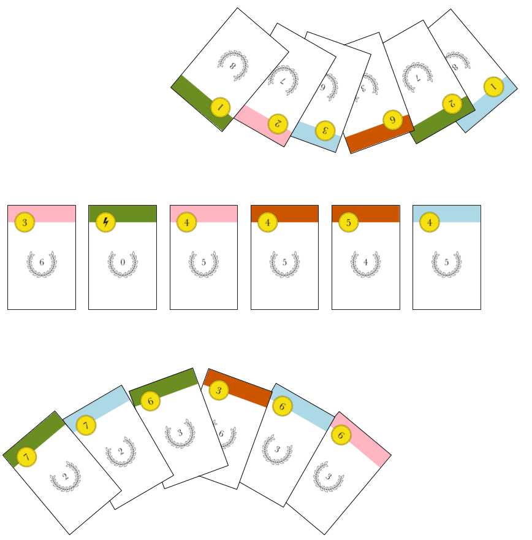

**A card game by Richard Hoile**

- For 2 players
- Age: 10+
- Playing time: 20 minutes

Dutch is a quick-playing card game which fuses elements of deckbuilders, traditional card games and auctions.

Players compete to build the most valuable deck by buying cards from a Dutch auction, where the cost of cards is constantly dropping. But which cards to buy? The cards richest in victory points will not on their own allow you to outbid your opponent, or activate the powers needed to build the finest deck.

**Submitted to the 2019 Hippodice Competition**

