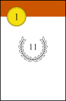
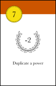
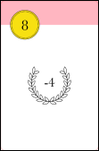
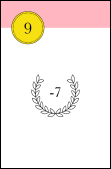
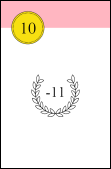
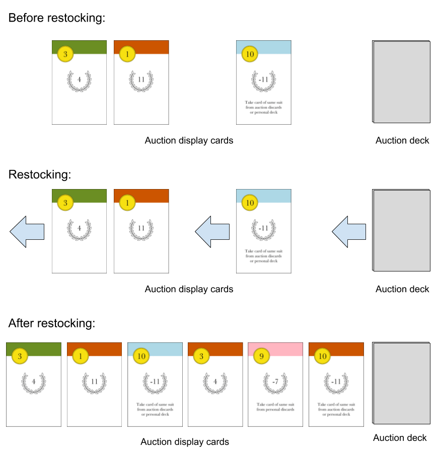

# Intro

What is this game about? How many players?

# Objective

During the game, players buy new cards to add to their personal deck of cards. Each card has an associated victory point value. At the end of the game, the player with the most victory points in his deck is the winner.

# Components

Dutch comprises just 40 cards, divided into 4 suits (green, red, pink, blue) of 10 cards each.

All ten cards from the red suit are shown below. The number in the top-left-hand corner is the **bid value**. The number in the laurel wreath is the card's **victory point (VP) value**. The text beneath the VP value on is the card's ** power**.

   

    

  

All suits are identical in respect to their bid values, victory points and powers.

Henceforth, indvidual cards will be identified by their suit and bid value, for example 'red one-bid' or 'blue five-bid'.

# Set-up
Each player is dealt a personal deck of eight cards. Players may look at their personal deck, providing they shuffle it afterwards (see **Peaking at Cards** below). Each player takes the top five cards from their personal deck into their hand, which they should keep hidden from their opponent.

The 24 remaining cards form the **auction deck**, which is placed face-down between the two players. Six cards are drawn from the auction deck and placed face-up in a row next to the auction deck - these are the **auction display cards**. As the game progresses, both players will have a **personal discard pile**.

# Gameplay
## Overview
A round consists of the following phases:
1. **Set aside one card from hand** (both players simultaneously)
2. **Bid** (both players simultaneously)
3. **Use powers and purchase cards** (first the winner of the bid, then the loser of the bid)
5. **Restock auction display**
6. **Draw new hand of cards** (both players simultaneously)

The phases are explained in more detail below.

## Phase 1. Set aside one card
From their starting hand of five cards, each player chooses a single card to set aside *face down* and *on top of their personal deck* (**not** into their discard pile).

## Phase 2. Bid
From their remaining hand of four cards, players play up to four cards to bid for the right to go first in phase 3. A player with power cards in their hand may choose not to bid with them, using them instead for their power in phase 3.

Cards are played face down and revealed simultaneously by both players - these are the players' bid cards. The total value of a players's bid is the sum of each bid card's bid value. The player with the higher bid is the winner.

If the players' total bids tie, each player must add the top card from their personal deck to their bid. The bid values are then compared. If the bids still tie, another card is added from the top of the personal decks, and so on.

*In the diagram below, Jean makes a bid using all four cards from her hand. The value of her bid is 4+2+8+2=16. Tom, meanwhile, uses only three cards for his bid, keeping one back in his hand to use during phase 3. The value of Tom's bid is 10+3+2=15. Jean wins the bid, so she will go first in phase 3.*

## Phase 3. Use powers and purchase cards
In phase three the players may play power cards and then purchase cards. The winner of the phase 2 bid goes first. Once the winner has finished playing  power cards and purchasing cards, the loser may then do the same.

### Use powers
When a card is played for its power, it is placed face up next to, but separate from, the bid cards. A player's bid cards and power cards together make up their 'offering'. When played during phase 3, a power card is immediately 'activated'.

The following powers will be found in the game:

**Cash in any card of same suit** (found on six-bids cards): Allows player to remove any other card in their offering from the game, providing they share the same suit. Once removed, the card will no longer be part of the player's deck, but will still count towards the player's VPs at the end.

**Duplicate a power card of same suit** (found on seven-bids cards): Allows player to duplicate another power card's power, providing they share the same suit. For example, if played alongside a card with the 'cash in any card of same suit' power, two cards, rather than just one, can potentially be cashed in. The duplicate power can also be used on a card which has already been activated, allowing it to be activated one more time.

**Take card of same suit from auction discard** (found on eight-bids cards): Allows player to look through the auction discards and retrieve a card that matches the suit of the power card. The retrieved card may then be added to the player's offering. If the retrieved card also has a power, that power is then activated.

**Take card of same suit from personal discards** (found on nine-bids cards): As above, except player may look through their *personal discards* rather than the auction discards.

**Take card of same suit from personal or auction discards** (found on ten-bids cards).

When a card is played for its power, it always remains in the player's offering.

*In the example below, Catherine played  two bid cards during phase 2. The value of her bid, 7+2=9, was enough to win the bid. She now adds two power cards to her offering: a blue six-bid and a blue nine-bid. The six-bid's power allows her to cash in a card of the same suit. She chooses to cash in the blue two-bid, which she puts aside until the end of the game (the advantage of this is that she no longer has a weak 'two-bid' diluting the future bidding power of her deck). Her other power card, a blue nine-bid, allows her to take a blue three-bid from her personal discards and add it to her offering. Following activation of her power cards, her offering will consist of a green seven-bid and a blue six-bid, nine-bid and three-bid.*

### Purchasing cards

After optionally playing power cards, the player may now purchase cards from the auction display, paying for them using cards from their offering.

The cost of the auction display cards is determined by their position, as illustrated below. An *n*-cost card is one that costs *n* cards from the player's offering.

To pay for a card, the player takes the correct number of cards from their offering and puts them in either:
* their **personal discards** (if the purchased card matches the suit of the cards used to purchase it)
* the **auction discards** (if the purchased card does not match the suit of the cards used to purchase it).

The purchased cards themselves are always added to the player's *personal discards*, not to the offering.

Players may make as many purchases as they can afford. The loser of the phase 2 bid has an extra obligation: **if the one-cost auction display card was not purchased by the winner of the bid, the loser *must* purchase it.**

*In the example below, Catherine has three cards blue cards, which she uses to purchase the three-cost blue four-bid card in the auction display. As all the cards used for purchasing match the suit of the purchased card, they are all placed in the patient's personal discards, along with the purchased card.*

If the player is purchasing a multiple-cost card, some of the cards used to purchase it may end up in their personal discards (if they match the suit of the purchased card) and some may end up in the auction discards (if they do no match the suit).

*In the example below, Dieter first chooses to purchase the one-cost red eight-bid. He puts the purchased card in his personal discards (because that is where all purchased cards go), and the blue card used to purchase it in the **auction** discards (because it does not match the suit of the purchased card). He then decides to purchase the two-cost green nine-bid, using his green and pink cards. He puts the purchased nine-bid in his personal discards, along with the green card used to purchase it. However, the pink card, which was also used to purchase the nine-bid, goes in the auction discards, as it does not match the suit of the nine-bid.*

There may be occasions when a player will want to play a power card **after** they have made a purchase. *In the example below, Elizabeth uses her pink one-bid to buy the pink four-bid from the auction display. She then uses her pink nine-bid for its special power, choosing to retrieve the pink one-bid from her personal discards and return it to her offering. She now uses the retrieved pink one-bid with her pink three-bid to purchase the pink ten-bid from the auction display.*

Further examples are given in **More about using power cards** below.

## Phase 4. Restocking the auction display

Any unpurchased cards will remain in the auction display, but will be moved along so that they occupy the lowest cost positions, with no gaps remaining between careds. The auction display is then restocked with new cards from the auction deck.

*In the example below, there are only three cards left in the auction display after the players have made their purchases, in the two-cost, three-cost and four-cost positions respectively. To fill in the gaps, the remaining cards are all shifted as far left as they can go, and three new cards are added from the auction deck.*

## Phase 5. Drawing a new hand of cards

Finally, players put any unused cards from their offering into their personal discards, and then draw a new hand of five cards from the top of their auction deck. (The first of the five cards to be drawn will of course be the card discarded during phase 1.)

A new round will begin, starting at phase 1.

# End of the game

Players will continue to play rounds until the  auction deck has been exhausted and either there are no remaining auction display cards, or neither player wants to purchase the display cards that remain.

At this point, players gather together their personal deck, discards and any 'cashed-in' cards, and then sum their total VPs. **In addition, a bonus ten VPs is awarded for any suit which a player has at least six of.**

The player with the most victory points is the winner. If players are tied for the highest score, the player with the fewest cards wins.

# Peaking at cards

During the game, players make look through their own personal discards and the auction discards, but not the discards of their opponent. In addition, they may look through their own personal deck, providing they shuffle it afterwards. It is not permitted to look through the auction deck at any time.

# More about using power cards

The following example is intended to show a more complex use of power cards.

*Femi has played two bid cards during phase 2, and having won the bid, goes on to play two power cards in phase 3. The blue six-bid allows Femi to 'cash in' another blue card, so Femi chooses to cash in his blue three-bid and puts it to aside. He then plays his blue ten-bid, which allows him to take a blue card from either the auction discards or his personal deck. He choose to take the blue nine-bid from the auction discards, which he adds to his offering, and, as it is a power card, is immediately activated, allowing him to take a blue card from his personal discards. He takes the blue seven-bid and adds it to his offering. Again, this new card is immediately activated, and allows him to duplicate a blue power card. If there were any unactivated blue power cards left in his offering, he would be able to activate the unused card twice using the duplicate power. However, all the power cards have already activated, so he uses the duplicate power to reactivate the already-activated blue six-bid a single time, which allows him to 'cash in' the blue 'fiver'. At the end of phase 3, Femi has four cards in his offerings (a nine-bid, ten-bid, six-bid and a seven-bid) with which he can purchase cards.*

# Clarifications

**Does the suit of a card matter when bidding in phase 2?** No, only the bid value of the card is relevant for bidding.

**Does the bid value of a card matter when used for purchasing a card during phase 3?** No, only the suit of a the card is relevant for purchasing.

**When you purchase a card, does the newly purchased card get added to the player's offering?**. No - whereas a power card may retrieve a card from a pile (e.g. the auction discards) and add that card to the offering, a purchased card is never added to the offering. It is always placed immediately in the player's discards.
