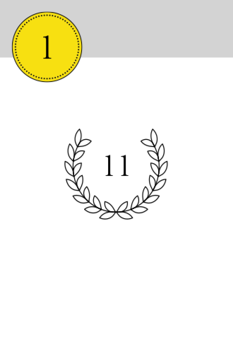

# Intro

What is this game about? How many players?

# Objective

During the game, players buy new cards to add to their personal deck of cards. Each card has an associated victory point value. At the end of the game, the player with the most victory points in his deck at the end of the game is the winner. 

# Components

40 cards, divided into 4 suits (green, red, pink, blue) of 10 cards each.

A sample card is shown below. The number in the top-left-hand corner is the **bid value**. The number in the laurel wreath is the card's victory points.

# Set-up

# Gameplay
## Bidding
## Using powers
## Purchasing
## Restocking the auction lay
## Drawing a new hand of cards

# End of the game

The game ends when there auction deck has been exhausted, and either there are no remaining auction display cards, or neither of the two players wants to purchases the ones that remain.

At this point, players add their discards to their personal deck and add up their total VPs. In addition, a bonus ten VPs is awarded for any suit which a player has at least six of.

The player with the most victory points is the winner. If players are tied for the highest score, the player with the fewest cards wins.
