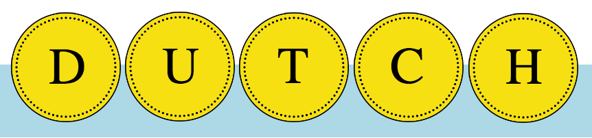
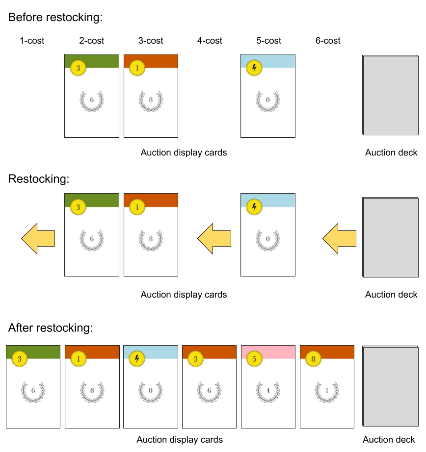

# Intro

A card game for 2 players, ages 10 and up. Playing time: 15 minutes. By Richard Hoile.

Players compete to buy the best cards from a Dutch auction, where the cost of cards is constantly dropping. A fine balance must be struck - the cards needed to outbid, hide and steal from your opponent during the game may not be the ones that score you the most points at the end of the game.

# Objective

To have the most victory points (VPs) in your personal deck when the auction runs out of cards.

# Components

40 cards, divided into 4 suits (green, red, pink, blue) of 10 cards each.

All ten cards from the blue suit are shown below. In the top-left-hand corner is the **bid value** or, in the case of the two power cards, the **power symbol**. The number in the laurel wreath is the card's **VP value**.

All suits are identical in every respect other than their colour.

Players should refer to non-power cards by their suit and bid value, for example 'red 1-bid' or 'blue 5-bid'.

# Set-up
Each player is dealt a personal deck of nine cards. Players may look at their personal deck, providing they shuffle it afterwards (see **Peaking at Cards** below). Each player takes the top five cards from their personal deck into their hand.

The 22 remaining cards form the **auction deck**, which is placed face-down between the two players. Six cards are drawn from the auction deck and placed face-up in a row next to the auction deck - these are the **auction display cards**.

# Gameplay
## Overview
A round consists of the following phases:
1. **Set aside one card from hand** (both players simultaneously)
2. **Bid** (both players simultaneously)
3. **Use powers and purchase cards** (first the winner of the bid, then the loser of the bid)
5. **Restock auction display**
6. **Draw new hand of cards** (both players simultaneously)

The phases are explained in more detail below.

## Phase 1. Set aside one card
From their starting hand of five cards, each player chooses a single card to set aside *face down* and *on top of their personal deck*.

## Phase 2. Bid
Players now bid for the right to go first in phase 3, by playing all four cards from their hand face down. Both bids are revealed simultaneously.

The total value of a players's bid is the sum of each card's bid value. Power cards have a bid value of zero. The player with the higher bid is the winner.

If the players' total bids tie, each player must add the top card from their personal deck to their bid. The bid values are then compared again. If the bids still tie, another card is added from the top of the personal decks, and so on.

*In the diagram below, Jeanne's bid is 6+3+0+7=16. Tom's bid is 0+3+2+3=8. Jeanne wins the bid, so she will go first in phase 3.*

## Phase 3. Activate powers and purchase cards
In phase three the players may **activate a power card** and/or **purchase cards from the auction display**. The winner of the phase 2 bid goes first.

### Activate powers

All power cards in a player's bid can be activated. When activated, each power card may perform any one of the following powers:

**Cash in a card**: Allows player to select another card *of the same suit* from their bid, and remove it from the game. Once removed, the card will no longer be part of the player's deck, but will still count towards the player's VPs at the end.

**Change a card's suit**: Allows player to temporarily change the suit of another card  *of the same suit* from their bid (e.g. a red power card can turn another red card into a blue card). To indicate that the card has changed suit, its coloured band should be covered up by the power card.

**Take card from auction discards, personal discards or auction display cards**: Allows player to retrieve a card that matches the suit of the power card. The taken card may then be added to the player's bid. If the taken card is a power card, then that power is in turn activated.

**Steal card from opponent's bid**: As above, except player takes a card from *their opponent's bid*. This power is only available to the winner of the phase 2 bid.

Power cards only act on cards that 1) of the same suit as the power card and 2) part of the player's bid (or the opponent's bid, in the case of the Steal power).

After activation, power cards remain in the player's bid and can be used to purchase cards (along with any cards taken or stolen by the power card).

*In the example below, Catherine has won the phase 2 bid with a bid value of 7+2+0+0=9. Now her blue and pink power cards can be activated. She uses the blue power card to cash in her blue 2-bid, which she puts aside until the end of the game (see Clarifications for an explanation of why she may want to do this). She then uses her pink power card to take the pink 2-bid from her personal discards and adds it to her bid. Her bid will now consist of four cards: a green 7-bid, a blue power card, a pink power card and a pink 2-bid.*
''

### Purchase cards

After optionally playing power cards, the player may now purchase cards from the auction display, paying for them using cards from their bid.

The cost of the auction display cards is determined by their position, as illustrated below. The 5-cost card, for example, costs five cards.

To pay for a card, the player takes the correct number of cards from their bid and puts them in either:
* their **personal discard pile** - if the purchased card matches the suit of the card used to purchase it.
* the **auction discard pile** - if the purchased card does not match the suit of the card used to purchase it.

The purchased cards themselves are always added to the player's *personal discard pile*, not to the bid (in this respect, purchased cards differ from cards taken or stolen using power cards).

Players may make as many purchases as they can afford.

*In the example below, Elizabeth wants to purchase the blue 4-bid card in the 3-cost position of the auction display. She purchases it using her three blue cards, which are placed in the player's personal discards along with the purchased card.*

If the player is purchasing a multiple-cost card, some of the cards used for purchase may end up in the player's personal discards (if they match the suit of the purchased card) while others end up in the auction discards (if they do not match).

*In the example below, Dieter first chooses to purchase the 1-cost red 8-bid. He puts the purchased card in his personal discards (because that is where all purchased cards go), and the blue power card used to purchase it in the **auction** discards (because it does not match the suit of the purchased card). He then decides to purchase the green 8-bid, using his green 4-bid and pink 6-bid. He puts the purchased card in his personal discards, along with the green 4-bid. However, the pink 6-bid is placed in the auction discards, as it does not match the suit of the purchased card.*

There may be occasions when a player will want to activate a power card **after** they have made a purchase. See **Further power card examples** below.

### End of winner's phase 3 actions
After the winner of the bid has finished performing their phase 3 actions, they put any unused bid cards in their personal discards.

It is now the loser of the bid's turn to perform their phase 3 actions. These are performed in the same way, but with two exceptions:
- the loser must purchase the 1-cost card if it has not yet been purchased
- the 'steal' power is not available to the loser

## Phase 4. Restocking the auction display

The auction display is restocked only after both players have performed their phase 3 actions.

Any cards not purchased or taken by a power card during phase 3 will remain in the auction display, but are shifted leftwards so that they occupy the lowest cost positions, with no gaps between cards. The auction display is then restocked with new cards from the auction deck.

*In the example below, there are only three cards left in the auction display after the players have made their purchases, in the 2-cost, 3-cost and 4-cost positions respectively. To fill in the gaps, the remaining cards are all shifted as far left as they can go, and three new cards are added from the auction deck.*

## Phase 5. Drawing a new hand of cards

Players draw a new hand of five cards from the top of their personal deck. (The first of the five cards to be drawn will be the card discarded during phase 1.)

If there are less than five cards in a player's personal deck, the player should shuffle their personal discards and turn them upside down to form a new personal deck. Any remaining cards from the old deck should be placed face down on top of the new deck. The player can now draw their hand of five cards from the new deck.

When both players have drawn their hand, a new round will begin, starting at phase 1.

# End of the game

Play continues until 1) the auction deck is exhausted and 2) either there are no auction display cards left, or neither player wants to purchase any that remain.

At this point, players gather together their personal deck, discards and any cashed-in cards, and then sum their total VPs. **In addition, both players receives a VP bonus for each of their suits, equal to the VP of the lowest-scoring card in that suit.**

The player with the most VPs is the winner. If players are tied for the highest score, the player with the fewest cards wins.

*In the example below, the game has ended and Imran has sorted all his cards by suit to make scoring easier. He scores his suits as follows (with the final number in each sum being the bonus):*
- Pink: 7 + 8 + 7 = 22
- Green: 3 + 6 + 8 + 3 = 20;
- Blue: 0 + 0 + 2 + 5 + 7 + 0 = 14
- Red: 0 + 7 + 0 = 7

*Imran's total score:* 22 + 20 + 14 + 7  = 63.

# Peaking at cards

During the game, players may look through their personal discards and the auction discards, but not those of their opponent. In addition, they may look through their personal deck, providing they shuffle it afterwards. It is not permitted to look through the auction deck at any time.

# Further power card examples

The example below shows how the order in which phase 3 actions are performed is flexible. Frida uses her pink 3-bid to buy the pink 4-bid from the auction display. She then uses her pink power card to retrieve the pink 3-bid from her personal discards and return it to her bid. She finally uses the retrieved pink 3-bid with her pink power card to purchase the pink 8-bid from the auction display.

In the next example, Femi uses his blue power card in the following example to 'cash in' his blue 3-bid. He then uses his red power card to take the red power card from the auction discards and add it to his bid. This new red power card is in turn activated, and he uses it to temporarily change the suit of the red 4-bid to pink. His 4-bid (which is now temporarily pink) is then used to purchase the 1-cost card from the auction display - and because the purchasing card matches the colour of the purchased card, he gets to put it in his personal discards rather than losing it to the auction discards.

# Clarifications

**Does the suit of a card matter when bidding in phase 2?** No, only the bid value of the card is relevant for bidding.

**Does the bid value of a card matter when used for purchasing a card during phase 3?** No, only the suit of a the card is relevant for purchasing.

**When you purchase a card, does the newly purchased card get added to the player's bid?** No - whereas a power card may retrieve a card from a pile (e.g. the auction discards) and add that card to the bid, a purchased card is never added to the bid. It is always placed immediately in the player's discards.

**Why would someone want to 'cash in' a card?** By cashing in a card, that card is taken out of play until the end of the game, when it will count towards a player's victory points. There are two reasons to cash in: 1) a cashed-in card cannot be stolen by an opponent's power card; 2) if a card has a low bid-value, by cashing it in you are effectively strengthening your deck's overall bid power.
