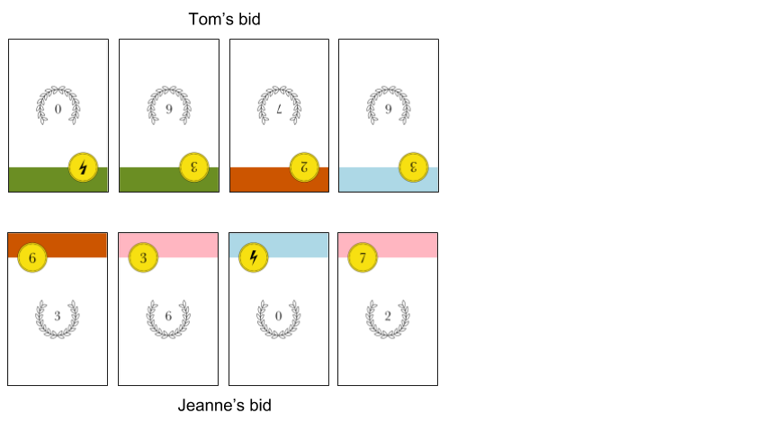

By **Richard Hoile**
# Intro

- A card game for 2 players
- Ages 10 and up
- Playing time: 20 minutes

Players compete to build the most valuable deck by buying cards from a Dutch auction, where the cost of cards is constantly dropping. But which cards to buy? The cards richest in victory points will not on their own allow you to outbid your opponent, or activate the powers needed to build the finest deck.

# Objective

To have the most victory points (VPs) in your personal deck when the auction runs out of cards.

# Components

40 cards, divided into 4 suits (green, red, pink, blue) of 10 cards each.

All ten cards from the blue suit are shown below. In the top-left-hand corner is the **bid value** or, in the case of the two power cards, the **power symbol**. The number in the laurel wreath is the card's **VP value**.

All suits are identical in every respect other than their colour.

Players should refer to non-power cards by their suit and bid value, for example 'red 1-bid' or 'blue 5-bid'.

# Set-up
Each player is dealt a **personal deck** of ten cards.

Players should then inspect their personal deck. If unhappy with the cards they have been dealt, a player may, once only, discard any unwanted cards from their personal deck and replace them with the same number of new cards. The discarded cards should then be shuffled back into the main deck.

Each player then shuffles their personal deck and places it face down in front of them. Each player then takes the top six cards from their personal deck into their hand.

The 20 remaining cards form the **auction deck**, which is placed face-down between the two players. Six cards are drawn from the auction deck and placed face-up in a row next to the auction deck - these are the **auction display cards**.

# Gameplay
## Overview
A round consists of the following phases:
1. **Set aside two cards**
2. **Bid**
3. **Winner purchases cards and/or activates powers**
4. **Loser purchases cards and/or activates powers**
5. **Restock auction display**
6. **Draw new hand of cards**

The phases are explained in more detail below.

## Phase 1. Set aside two cards
From their starting hand of six cards, each player chooses two cards to set aside *face down* and *on top of their personal deck*.

## Phase 2. Bid
Players now bid for the right to go first in the next phase, by playing all four cards from their hand face down. Both bids are revealed simultaneously.

The total value of a players's bid is the sum of each card's bid value. Power cards have a bid value of zero. The player with the higher bid is the winner.

If the players' total bids tie, each player must add the top card from their personal deck to their bid. The bid values are then compared again. If the bids still tie, the top card is again added, and so on.

*In the diagram below, Jeanne's bid is 6+3+0+7=16. Tom's bid is 0+3+2+3=8. Jeanne wins the bid, so she will go first in phase 3.*

## Phase 3. Winner purchases cards and/or activates powers
The winner of the bid may now **purchase cards from the auction display** and/or **activate a power card**, any number of times and in any order.

### Purchase cards
The cost of the auction display cards is determined by their position, as illustrated below. The 5-cost card, for example, costs five cards.

To pay for a card, the player takes the appropriate number of cards from their bid and puts them in either:
* their **personal discard pile** - if the purchased card matches the suit of the card used to purchase it.
* the **auction discard pile** - if the purchased card does not match the suit of the card used to purchase it.

The purchased cards themselves are always added to the player's *personal discard pile*, not to the bid.

Players may make as many purchases as they can afford.

*In the example below, Elizabeth wants to purchase the blue 4-bid card in the 3-cost position of the auction display. She purchases it using her three blue cards, which are placed in the player's personal discards along with the purchased card.*

If the player is purchasing a multiple-cost card, some of the cards used for purchase may end up in the player's personal discards (if they match the suit of the purchased card) while others end up in the auction discards (if they do not match).

*In the example below, Dieter first chooses to purchase the 1-cost red 8-bid. He puts the purchased card in his personal discards (because that is where all purchased cards go), and the blue power card used to purchase it in the auction discards (because it does not match the suit of the purchased card). He then purchases the green 8-bid, using his green 4-bid and pink 6-bid. He puts the purchased card in his personal discards, along with the green 4-bid. However, the pink 6-bid is placed in the auction discards, as it does not match the suit of the purchased card.*

### Activate power cards
All power cards in a player's bid may be activated. Activating power cards can take place before or after purchasing cards. When activated, a power card may perform either of the following powers:

- **Add a power card (of any suit) from a player's personal discards to their bid**: Any extra power card added to the bid in this way is immediately activated.
- **Purchase a card at one-cost from the auction discard pile or auction display**: Allows player to purchase *any single* card from one of these two locations, using the power card itself as payment. If purchasing a card from the auction display, the position of the auction display card (e.g. 3-cost, 5-cost) is irrelevant. Normal purchasing rules are followed.

*In the example below, Catherine has won the phase 2 bid with a bid value of 7+2+0+8=18. She activates the blue power card to retrieve the pink power card from her personal discards, which is in turn used to retrieve the second blue power card from her personal discards. This blue power card is in turn activated to purchase the blue 4-bid from the auction display. Both the blue power card and the blue 4-bid are then placed in the personal discards. At the end of this series of power card activations, her bid consists of a green 7-bid, a pink power card, a blue power card, a blue 2-bid and a green 8-bid, all of which can be used for purchasing further cards.*  

The example below shows how purchasing and power activation can be performed in any order.

*Frida uses her pink power card to purchase the pink 8-bid from the auction display - both cards are placed in her personal discards. She then uses her blue power card to retrieve the pink power card from her personal discards and return it to her bid. She then activates the retrieved pink power card's power to purchase the pink 4-bid from the auction display - both these cards are placed in her personal discards. Her bid now comprises the blue power card, red 3-bid and green 2-bid, which she can use to purchase further cards.*

After the winner of the bid has finished performing their phase 3 actions, they put any unused bid cards in their personal discards.

## Phase 4. Loser purchases cards and/or activates power cards
Now it is the loser's turn to purchase cards and/or activate power cards. There is only one difference: **the loser must receive the one-cost card for free** if it has not already been purchased.

## Phase 5. Restocking the auction display
The auction display is restocked only after phases 3 and 4 have been performed.

Any cards not purchased during phases 3 and 4 will remain in the auction display, but are shifted to the left so that they occupy the lowest cost positions, with no gaps between cards. The auction display is then restocked with new cards from the auction deck.

*In the example below, there are only three cards left in the auction display after the players have made their purchases, in the 2-cost, 3-cost and 5-cost positions respectively. To fill in the gaps, the remaining cards are all shifted as far left as they can go, and three new cards are added from the auction deck.*

## Phase 6. Drawing a new hand of cards

Players draw a new hand of six cards from the top of their personal deck. (The top two cards of their personal deck will be the cards set aside during phase 1.)

If there are less than six cards in a player's personal deck, the player should shuffle their personal discards and turn them face down to form a new personal deck. Any remaining cards from the old deck should be placed face down on top of the new deck. The player can now draw their hand of six cards from the new deck.

When both players have drawn their hand, a new round will begin, starting at phase 1.

# End of the game

Play continues in this manner until the auction deck (but not the auction display) has run out, at which point play will continue for one more round.

At the end of this final round, players gather together their personal deck and discards, and then arrange these cards by suit. Points are scored as follows:
- **For the long suit** (i.e. the suit in which the most cards are held): score each card
- **For all other suits**: score only the two lowest-scoring cards

The player with the most VPs is the winner. If players are tied for the highest score, the player with the fewest cards wins.

*In the example below, the game has ended and Imran has sorted all his cards by suit, which he scores as follows:*
- Pink: 7 + 8  = 15
- Green: 3 + 6 = 9
- Blue (long suit): 0 + 0 + 2 + 5 + 7 = 14
- Red: 0 + 7 = 7

*Imran's total score:* 15 + 9 + 14 + 7  = 63.

# Looking at cards

During the game, players may look through their personal discards and the auction discards, but not those of their opponent. In addition, they may look through their personal deck, providing they shuffle it afterwards. It is not permitted to look through the auction deck at any time.
