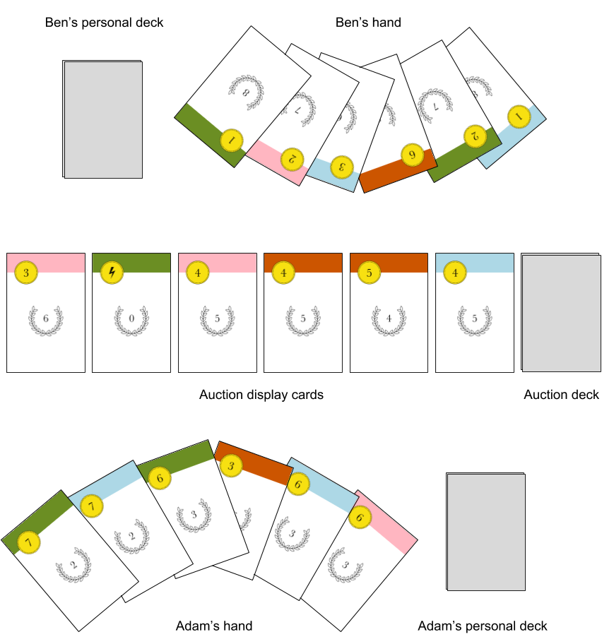
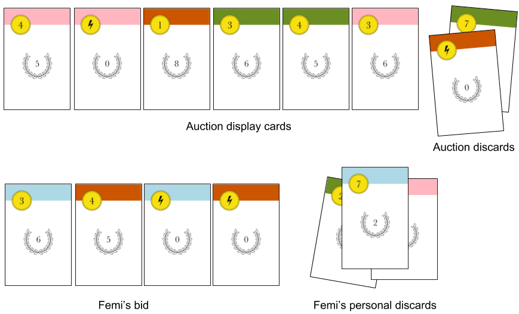

# Intro

A card game for 2 players, ages 10 and up. Playing time: 15 minutes. By Richard Hoile.

Players compete to buy the best cards from a Dutch auction, where the cost of cards is constantly dropping. A fine balance must be struck - the cards needed to outbid, rob and escape your opponent during the game are not the ones that will score you points at game end.

# Objective

To have the most victory points (VPs) when the auction runs out of cards.

# Components

40 cards, divided into 4 suits (green, red, pink, blue) of 10 cards each.

All ten cards from the blue suit are shown below. In the top-left-hand corner is the **bid value** or, in the case of the two power cards, the **power symbol**. The number in the laurel wreath is the card's **VP value**.

All suits are equally-balanced in respect to their bid values, victory points and powers.

Players should refer to non-power cards by their suit and bid value, for example 'red 1-bid' or 'blue 5-bid'.

# Set-up
Each player is dealt a personal deck of nine cards. Players may look at their personal deck, providing they shuffle it afterwards (see **Peaking at Cards** below). Each player takes the top five cards from their personal deck into their hand.

The 24 remaining cards form the **auction deck**, which is placed face-down between the two players. Six cards are drawn from the auction deck and placed face-up in a row next to the auction deck - these are the **auction display cards**.

# Gameplay
## Overview
A round consists of the following phases:
1. **Set aside one card from hand** (both players simultaneously)
2. **Bid** (both players simultaneously)
3. **Use powers and purchase cards** (first the winner of the bid, then the loser of the bid)
5. **Restock auction display**
6. **Draw new hand of cards** (both players simultaneously)

The phases are explained in more detail below.

## Phase 1. Set aside one card
From their starting hand of five cards, each player chooses a single card to set aside *face down* and *on top of their personal deck*.

## Phase 2. Bid
Players now bid using their remaining four cards for the right to go first in phase 3.

The cards are played face down to form the player's **bid**. Both bids are revealed simultaneously.

The total value of a players's bid is the sum of each card's bid value. Power cards have a bid value of zero. The player with the higher bid is the winner.

If the players' total bids tie, each player must add the top card from their personal deck to their bid. The bid values are then compared again. If the bids still tie, another card is added from the top of the personal decks, and so on.

*In the diagram below, Jeanne's bid is 6+3+0+7=16. Tom's bid is 0+3+2+3=8. Jeanne wins the bid, so she will go first in phase 3.*

## Phase 3. Use powers and purchase cards
In phase three the players may A) use the power cards played in the previous round, and/or B) purchase cards from the auction display. The winner of the phase 2 bid goes first. A) and B) may be performed in any order and any number of times - so a player could, for example, purchase a card, then use a power card, and then purchase another card; or play two power cards but make no purchases; or do nothing at all.

After the winner of the bid is finished performing their phase 2 actions, they put any unused bid cards in their personal discards. It is now the loser of the bid's turn to perform phase 3.

### A) Use powers

Each suit has two power cards, each of which can perform all the following actions:

**Cash in any card of same suit**: Allows player to remove any card *of the same suit* in their bid from the game. Once removed, the card will no longer be part of the player's deck, but will still count towards the player's VPs at the end.

**Change a card's suit**: Allows player to temporarily change the suit of any other card in their bid. This power can change a card of the same suit into any other suit (e.g. a red power card can turn a red 7-bid into a blue 7-bid); or change a card of a different suit into the same suit as the power card (e.g. a green power card can turn blue 4-bid into a green 4-bid).

**Take card of same suit from auction discard**: Allows player to look through the auction discards and retrieve a card that matches the suit of the power card. The retrieved card may then be added to the player's bid. If the retrieved card is a power card, then that power is activated. The newly-taken card should be placed below the power card, as a reminder that the power card has now been activated.

**Take card of same suit from personal discards**: As above, except player takes cards of samesuit from their *personal discards*.

**Steal card of same suit from opponent's bid**: As above, except player takes card of same suit from *their opponent's bid*. The loser of the phase 2 bid will not be able to steal from their opponent in this way, as the winner will have cleared away all their bid cards by the time the loser starts phase 3.

Activated power cards and any 'taken cards' remain in the player's bid and can be used to purchase cards. Activated power cards should be separated from a player's the other bid cards, as a reminder that they  cannot be activated again this round.

*In the example below, Catherine has won the phase 2 bid with a bid value of 7+2=9. Now her blue and pink power cards can be activated. She uses the blue power card to cash in her blue 2-bid, which she puts aside until the end of the game (see Clarifications for an explanation of why she may want to do this). She then uses her pink power card to take the pink 2-bid from her personal discards and adds it to her bid. Her bid will now consist of four cards: a green 7-bid, a blue power card, a pink power card and a pink 2-bid.*

### B) Purchase cards

After optionally playing power cards, the player may now optionally purchase cards from the auction display, paying for them using cards from their bid (i.e. any cards remaining from the original four bid cards, plus any cards added to the bid using power cards).

The cost of the auction display cards is determined by their position, as illustrated below. An *n*-cost card is one that costs *n* cards.

To pay for a card, the player takes the correct number of cards from their bid and puts them in either:
* their **personal discard pile** (if the purchased card matches the suit of the card used to purchase it)
* the **auction discard pile** (if the purchased card does not match the suit of the card used to purchase it).

The purchased cards themselves are always added to the player's *personal discard pile*, not to the bid.

Players may make as many purchases as they can afford. The loser of the phase 2 bid has an extra obligation: **if the 1-cost auction display card was not purchased by the winner of the bid, the loser *must* purchase it.**

*In the example below, Elizabeth wants to purchase the blue 4-bid card in the 3-cost position of the auction display. She purchases it using  all three of her blue cards. As all of the purchasing cards match the suit of the purchased card, they are all placed in the player's personal discards, along with the purchased card.*

If the player is purchasing a multiple-cost card, some of the cards used for purchase may end up in the player's personal discards (if they match the suit of the purchased card) while others end up in the auction discards (if they do not match).

*In the example below, Dieter first chooses to purchase the 1-cost red 8-bid. He puts the purchased card in his personal discards (because that is where all purchased cards go), and the blue power card used to purchase it in the **auction** discards (because it does not match the suit of the purchased card). He then decides to purchase the green 8-bid, using his green 4-bid and pink 6-bid. He puts the purchased card in his personal discards, along with the green 4-bid. However, the pink 6-bid is placed in the auction discards, as it does not match the suit of the purchased card.*

There may be occasions when a player will want to play a power card **after** they have made a purchase. *In the example below, Frida uses her pink three-bid to buy the pink 4-bid from the auction display. She then uses her pink power card to retrieve the pink three-bid from her personal discards and return it to her bid. She finally uses the retrieved pink three-bid with her pink power card to purchase the pink 8-bid from the auction display.*

Further examples are given in **More about using power cards** below.

## Phase 4. Restocking the auction display

Any unpurchased cards will remain in the auction display, but will be moved to the left so that they occupy the lowest cost positions, with no gaps remaining between cards. The auction display is then restocked with new cards from the auction deck.

*In the example below, there are only three cards left in the auction display after the players have made their purchases, in the 2-cost, 3-cost and 4-cost positions respectively. To fill in the gaps, the remaining cards are all shifted as far left as they can go, and three new cards are added from the auction deck.*

## Phase 5. Drawing a new hand of cards

Finally, players put any unused cards from their bid into their personal discards, and then draw a new hand of five cards from the top of their auction deck. (The first of the five cards to be drawn will of course be the card discarded during phase 1.)

A new round will begin, starting at phase 1.

# End of the game

Players will continue to play until there are no remaining auction display cards to buy, or neither player wants to purchase the display cards that remain.

At this point, players gather together their personal deck, discards and any 'cashed-in' cards, and then sum their total VPs. **In addition, both players receives for a VP bonus for each of their suits, equal to the VP of the lowest-scoring card in that suit.**

The player with the most VPs is the winner. If players are tied for the highest score, the player with the fewest cards wins.

*In the example below, the game has ended and Imran has sorted all his cards by suit to make scoring easier. He scores his suits as follows (with the final number in each sum being the bonus):*
- Pink: 7 + 8 + 7 = 22
- Green: 3 + 6 + 8 + 3 = 20;
- Blue: 0 + 0 + 2 + 5 + 7 + 0 = 14
- Red: 0 + 7 + 0 = 7

*Imran's total score:* 22 + 20 + 14 + 7  = 63.

# Peaking at cards

During the game, players may look through their personal discards and the auction discards, but not those of their opponent. In addition, they may look through their personal deck, providing they shuffle it afterwards. It is not permitted to look through the auction deck at any time.

# More about using power cards

The following example is intended to show a more complex use of power cards during phase 3.

*Femi uses his blue power card to 'cash in' his blue three-bid. He then uses his red power card to take the red power card from the auction discards and add it to his bid. This new red power card is in turn activated, and he uses it to temporarily change the suit of the red 4-bid to pink. His 4-bid (which is now temporarily pink) is then used to purchase the 1-cost card from the auction display - and because the purchasing card matches the colour of the purchased card, he gets to put it in his personal discards rather than losing it to the auction discards.x`*

# Clarifications

**Does the suit of a card matter when bidding in phase 2?** No, only the bid value of the card is relevant for bidding.

**Does the bid value of a card matter when used for purchasing a card during phase 3?** No, only the suit of a the card is relevant for purchasing.

**When you purchase a card, does the newly purchased card get added to the player's bid?** No - whereas a power card may retrieve a card from a pile (e.g. the auction discards) and add that card to the bid, a purchased card is never added to the bid. It is always placed immediately in the player's discards.

**Why would someone want to 'cash in' a card?** By cashing in a card, that card is taken out of play until the end of the game, when it will count towards a player's victory points. There are two reasons to cash in: 1) a cashed-in card cannot be stolen by an opponent's power card; 2) if a card has a low bid-value, by cashing it in you are effectively strengthening your deck's overall bid power.
