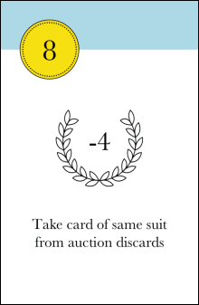

# Intro

What is this game about? How many players?

# Objective

During the game, players buy new cards to add to their personal deck of cards. Each card has an associated victory point value. At the end of the game, the player with the most victory points in his deck at the end of the game is the winner. 

# Components

40 cards, divided into 4 suits (green, red, pink, blue) of 10 cards each.

A sample card is shown below. The number in the top-left-hand corner is the **bid value**. The number in the laurel wreath is the card's **victory point (VP) value**. The text beneath the VP value is the card's **special power**.

Note that only cards with a bid value between six and ten have a special power. 

# Set-up
Each player is dealt a personal deck of eight cards. Players may look at these cards, but must then shuffle them and lay them face down in front of them - the personal deck may not be inspected again during the game. Each player takes the top five cards from their personal deck into their hand - they may look at these cards, and should not let their opponent see them.  

The 24 remaining cards form the face-down auction deck. Five cards are then drawn from the auction deck and placed face-up in a row next to the auction deck. All these auction display cards have a cost - the card closest to the auction deck costs 5 cards, the next closest costs 4 cards, and so on. The card furthest from the auction deck costs only 1 card. 

# Gameplay
## Overview
A round consists of the following phases:
1. Set aside one card from hand (both players)
2. Bid (both players)
3. Play special power cards (winner of bid only)
4. Buy cards from auction display (winner of bid only)
5. Loser of bid performs phases 3 and 4
5. Restock auction display
6. Draw new hand of cards 

The phases are explained in more detail below.

## 1. Set aside one card
From their starting hand of five cards, each player chooses a single card to set aside *face down* and *on top of their personal deck* (**not** into their discard pile). 

## 2. Bidding
From their remaining hand of four cards, players play up to four cards to bid for the right to purchase from the auction display before their opponent. The suit of the bid card is irrelevant at this stage. A player does not have to play any bid cards.

Bid cards are played face down and revealed simultaneously. The total value of a players's bid is the sum of each bid card's bid value. The player with the higher bid is the winner.

If the players' total bids tie, each player must add the top card from their personal deck to their bid. The bid values are then compared. If the bids still tie, another card is taken from the top of the personal decks, and so on. 

## 3. Using powers
The winner of the bid may then play any card(s) left in their hand for its power(s). The bid and power cards together make up a player's *offering*.

When a card is played for its power, it is played face up next to the bid cards. The power is then activated. A power card may have one or more of the following powers:

**Cash in any card of same suit**
Allows player to remove another card from their offering from the game. The target card, once removed, will no longer be part of the player's deck, but will still count towards the player's VPs at the end. 

**Change a card's suit**
Allows player to change the suit of a card from their offering. The target card may either be of the same suit as the power card (in which case the target card can temporarily become *any other* suit; or it may be of a different suit from the power card (in which case the target card must temporarily adopt the power card's suit).

**Duplicate a power card of same suit**
Allows player to duplicate another power card's power, providing they share the same suit.

**Take card of same suit from auction discard**
Allows player to look through the auction discards and retrieve a card that matches the suit of the power card. The retrieved card may then be added to the player's offering. If the retreived card also has a power, that power is then activated.

**Take card of same suit from personal discards**
As above, except player may look through their *personal discards* rather than the auction discards.

## 4. Purchasing

The winner of the bid, having optionally played power cards in phase 3, may purchase cards from the auction display, using cards from their offering. 

The cost of the auction display cards is determined by their position. The display card furthest away from the auction deck, for example, costs only one card. To pay for a card, the player takes the correct number of cards from their offering and puts them in either: 
* their personal discards (if the purchased card matches the suit of the cards used to purchase it)
* the auction discards (if the purchased card does not match the suit of the cards used to purchase it). 

If the player is purchasing a multiple-cost card, some of the cards used to purchase it may end up in their personal discards (if they match the suit of the purchased card) and some may end up in the auction discards (if they do no match the suit).

The purchased cards themselves are added to the player's *personal discards*, not to their offering. 

The player may make as many purchases as he can afford, providing the player has enough cards in their offering to pay for them. 

## 5. Loser of bid now performs phases 3 and 4

After the winner of the phase 2 bid has performed phases 3 and 4, the loser must now do the same. 

## 6. Restocking the auction display

Any unpurchased cards will remain in the auction display, but will be moved along so that they occupy the lowest cost positions, with no gaps remaining between careds. The auction display is then restocked with new cards from the auction deck. 

## Drawing a new hand of cards

Finally, each player draws a new hand of five cards from the top of their auction deck. One of the five cards will of course be the card discarded during phase 1. 

Players now proceed to phase 1 of the next round, and will do so until the auction deck is exhausted. 

# End of the game

The game ends when there auction deck has been exhausted, and either there are no remaining auction display cards, or neither player wants to purchases the ones that remain.

At this point, players gather together their personal deck, discards and any 'cashed-in' cards, and sum their total VPs. In addition, a bonus ten VPs is awarded for any suit which a player has at least six of.

The player with the most victory points is the winner. If players are tied for the highest score, the player with the fewest cards wins.
